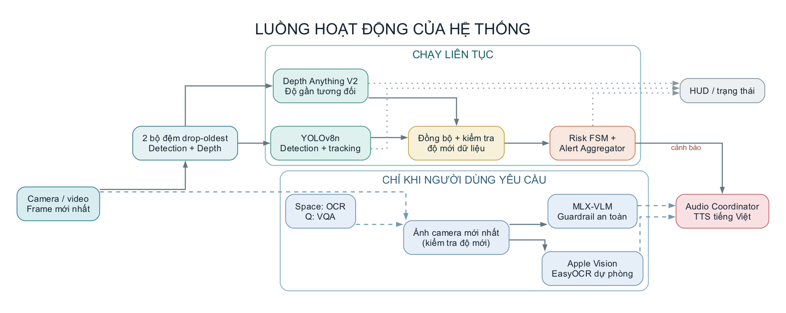

# Hệ thống AI đa phương thức hỗ trợ người khiếm thị

[](https://github.com/lqmnhat13/Do-An-Tot-Nghiep/actions/workflows/cicd.yml)

Đồ án xây dựng một ứng dụng **chạy cục bộ trên macOS Apple Silicon** để mô tả môi trường qua âm thanh tiếng Việt. Camera cung cấp ảnh cho phát hiện vật thể, ước lượng **độ gần tương đối** và cảnh báo va chạm; OCR và hỏi đáp thị giác (VQA) chỉ chạy khi người dùng yêu cầu. Runtime không cần cloud API hay telemetry. Việc tải model là bước chuẩn bị riêng, cần mạng khi tài nguyên chưa có.

> **Lưu ý an toàn:** Đây là nguyên mẫu nghiên cứu, không phải thiết bị dẫn đường đã được chứng nhận. Model có thể bỏ sót vật cản, đọc sai chữ hoặc mô tả sai ảnh. VQA không xác nhận đường đi an toàn; người dùng vẫn cần gậy dẫn đường, kỹ năng định hướng và hỗ trợ phù hợp.

## Mục lục

- [Chức năng và luồng hoạt động](#chức-năng-và-luồng-hoạt-động)
- [Yêu cầu và model](#yêu-cầu-và-model)
- [Cài đặt và chạy nhanh](#cài-đặt-và-chạy-nhanh)
- [Sử dụng ứng dụng](#sử-dụng-ứng-dụng)
- [Kiểm thử và đánh giá](#kiểm-thử-và-đánh-giá)
- [Giới hạn và an toàn](#giới-hạn-và-an-toàn)
- [Cấu trúc và tài liệu](#cấu-trúc-và-tài-liệu)
- [Giấy phép và nguồn model](#giấy-phép-và-nguồn-model)

## Chức năng và luồng hoạt động



[Nguồn sơ đồ Graphviz](docs/architecture-flow.dot) có thể sửa và xuất lại bằng `dot -Tpng -Gdpi=120 docs/architecture-flow.dot -o docs/architecture-flow.png`.

| Thành phần | Vai trò | Thời điểm chạy |
| --- | --- | --- |
| Camera và bộ đệm | Một luồng thu ảnh, phân phối qua hai bộ đệm `drop-oldest` để bỏ frame cũ khi xử lý chậm. | Liên tục |
| Detection + tracking | YOLOv8n phát hiện các lớp được cấu hình; ByteTrack theo dõi đối tượng qua các frame. | Liên tục |
| Depth + đồng bộ | Depth Anything V2 ước lượng độ gần tương đối; bộ đồng bộ kiểm tra độ mới và ghép với detection. | Liên tục |
| Risk FSM + âm thanh | Đánh giá rủi ro từ dữ liệu hợp lệ, điều phối cảnh báo bằng TTS và âm báo. | Liên tục |
| OCR | Apple Vision trên macOS, EasyOCR dự phòng; kiểm tra chất lượng ảnh trước khi đọc. | Khi bấm `Space` |
| VQA | MLX-VLM mặc định; guardrail từ chối khẳng định đường đi an toàn. | Khi bấm `Q` |
| HUD | Hiển thị frame, trạng thái và kết quả xử lý gần nhất. | Khi bật GUI |

Khi OCR hoặc VQA đang xử lý, detection và depth vẫn tiếp tục chạy. Trong thời gian đó, cảnh báo `HIGH_RISK` vẫn được phép chen ngang câu trả lời; các cảnh báo thấp hơn được tạm hạn chế để không cắt lời liên tục. Khi dữ liệu detection/depth trễ hoặc không đạt chất lượng, hệ thống không tự suy ra rằng môi trường an toàn.

## Yêu cầu và model

- **Nền tảng mục tiêu:** macOS trên Apple Silicon M1, 16 GB unified memory; cần cấp quyền Camera cho ứng dụng Terminal khi dùng webcam.
- **Python:** môi trường dự án đã kiểm thử với Python 3.10 trong Conda `ai-macbook`.
- **Tăng tốc:** PyTorch MPS cho detection/depth; MLX cho VQA mặc định. Một số thành phần có thể dùng CPU hoặc fallback, nhưng độ trễ sẽ khác.
- **Âm thanh:** lệnh `say` của macOS, ưu tiên giọng tiếng Việt `Linh`; cần kiểm tra giọng này trên máy chạy.
- **Trọng số:** YOLO ở `models/weights/yolov8n.pt`; các model Hugging Face cần có trong cache hoặc thư mục local trước khi chạy offline. Snapshot VQA MLX được lưu tại `models/weights/qwen2_5_vl_3b_4bit` theo cấu hình hiện tại.

| Tác vụ | Model/backend mặc định | Cấu hình |
| --- | --- | --- |
| Phát hiện vật thể | YOLOv8n, lọc các lớp COCO liên quan | `configs/model_config.yaml` → `detection` |
| Độ gần tương đối | Depth Anything V2 Small | `configs/model_config.yaml` → `depth` |
| OCR | Apple Vision; EasyOCR tiếng Việt/Anh dự phòng | `configs/model_config.yaml` → `ocr` |
| VQA | Qwen2.5-VL-3B-Instruct-4bit qua MLX-VLM; backend BLIP + MarianMT là lựa chọn legacy | `configs/model_config.yaml` → `vqa` |
| TTS | `say` của macOS và các WAV cảnh báo | `configs/app_config.yaml` → `audio` |

`mlx-vlm` là dependency cài riêng, không nằm trong `requirements.txt`. Model VQA được nạp khi có yêu cầu, không nạp ở lúc khởi động. Nếu backend/model VQA không khả dụng, dịch vụ có thể dùng ngữ cảnh detection làm câu trả lời dự phòng; điều này không tương đương một câu trả lời VQA chính xác.

## Cài đặt và chạy nhanh

Nếu đã clone dự án hoặc có môi trường `ai-macbook`, bỏ qua các lệnh tương ứng. Các lệnh còn lại chạy từ thư mục gốc dự án.

```bash
git clone https://github.com/lqmnhat13/Do-An-Tot-Nghiep.git
cd Do-An-Tot-Nghiep
conda create -n ai-macbook python=3.10 -y
conda activate ai-macbook
python -m pip install -r requirements.txt
python -m pip install mlx-vlm
```

Chuẩn bị tài nguyên khi **có mạng**:

```bash
python scripts/download_models.py
python scripts/download_models.py --mlx-vlm
```

Lệnh đầu chuẩn bị YOLO, Depth Anything, EasyOCR, backend VQA legacy và các WAV mẫu; lệnh thứ hai tải riêng snapshot MLX-VLM mặc định. Lệnh đầu có thể tạo lại WAV và một số lỗi tải được in ra nhưng không nhất thiết làm tiến trình trả mã lỗi khác `0`: hãy đọc từng dòng `[OK]`/`[FAIL]`, rồi kiểm tra môi trường bằng `python scripts/inspect_environment.py`. Không cần tải lại nếu tài nguyên đã có.

Sau khi chuẩn bị, chạy **offline nghiêm ngặt**:

```bash
export SECOND_EYE_OFFLINE=1
export HF_HUB_OFFLINE=1
export TRANSFORMERS_OFFLINE=1
export YOLO_OFFLINE=1
python app.py --source 0
```

Không đặt các biến offline khi chủ động tải model. `--source 0` là webcam mặc định; có thể thay bằng đường dẫn video. Nếu macOS báo không mở được camera, kiểm tra quyền Camera của Terminal hoặc ứng dụng đang chạy lệnh. Khi chỉ cần kiểm tra khởi động/tắt mà không dùng webcam:

```bash
python app.py --source dummy --no-gui --duration 5
```

Nguồn `dummy` là ảnh giả lập, **không** chứng minh hệ thống hoạt động chính xác với camera thật.

## Sử dụng ứng dụng

| Phím | Tác dụng |
| --- | --- |
| `Space` | Chụp frame mới và đọc chữ bằng OCR. |
| `Q` | Hỏi VQA theo câu mặc định “Mô tả khung cảnh phía trước”. |
| `S` | Dừng giọng đọc và hủy kết quả OCR/VQA đang chờ. |
| `Esc` | Thoát cửa sổ và dừng hệ thống. |

Các phím trên chỉ hoạt động khi cửa sổ GUI có focus. Ở chế độ `--no-gui`, dùng `Ctrl+C` để dừng; không có thao tác OCR/VQA qua phím tắt GUI. Nếu cần thử riêng OCR trên ảnh hoặc đổi câu hỏi VQA trên webcam, dùng các CLI phụ trong [CLI.md](CLI.md). Hai CLI phụ đó **không** chạy pipeline cảnh báo; để thử trải nghiệm đầy đủ, dùng `app.py`.

## Kiểm thử và đánh giá

Chạy toàn bộ unit test trong môi trường `ai-macbook` đã kích hoạt. [AGENTS.md](AGENTS.md) cũng ghi lệnh tương đương với đường dẫn Python cố định trên máy phát triển:

```bash
HF_HUB_OFFLINE=1 TRANSFORMERS_OFFLINE=1 PYTHONPATH=. \
python -m unittest discover -s tests -p 'test_*.py' -v
```

Thử riêng các chức năng trên dữ liệu thật:

```bash
python scripts/run_ocr_camera.py --image /duong/dan/anh.jpg --no-speech
python scripts/run_vqa_camera.py --camera 0 --backend mlx_vlm --no-speech
python scripts/evaluate_video.py --video /duong/dan/video.mp4 --duration 30
```

`run_vqa_camera.py` hiện chỉ nhận webcam, không có `--image`. `evaluate_video.py` ghi báo cáo JSON mặc định tại `evaluation/results/eval_report.json`. `benchmark_vqa_backends.py` nhận bộ ảnh và câu hỏi JSONL để đo độ trễ/lỗi và hỗ trợ chấm thủ công; xem cú pháp trong [CLI.md](CLI.md). Script benchmark hiện chưa truyền đường dẫn model cho backend `mlx_vlm`, nên chưa dùng được backend đó trực tiếp qua tùy chọn `--backend mlx_vlm`.

**Cách đọc kết quả:** unit test và nguồn `dummy` chứng minh hành vi phần mềm ở các ca đã viết, không phải độ chính xác ngoài đời. Repo chưa kèm một bộ dữ liệu ảnh/video thật có nhãn và báo cáo định lượng đủ để kết luận OCR, VQA hoặc cảnh báo đã đạt mức tin cậy cho sử dụng độc lập. Khi công bố số liệu, cần ghi nguồn dữ liệu, số mẫu, cách gán nhãn, metric, thiết bị, phiên bản model và ngày đo.

## Giới hạn và an toàn

- Depth Anything V2 ở đây cho **độ gần tương đối**, không đo mét và không suy ra khoảng cách vật lý tuyệt đối.
- Camera mờ, lóa, bị che, thiếu sáng, ngoài khung hình hoặc vật thể ngoài các lớp detection có thể gây bỏ sót. Không có cảnh báo không có nghĩa là an toàn.
- OCR có thể đọc sai biển hiệu/chữ nhỏ; VQA có thể nhầm đối tượng, suy diễn hoặc trả lời quá ngắn/dài. Không dùng hai chức năng này làm nguồn xác nhận an toàn di chuyển.
- Dữ liệu detection/depth trễ hoặc không hợp lệ bị loại khỏi đánh giá rủi ro; hệ thống không phát cảnh báo dựa trên kết quả stale. Điều này cũng đồng nghĩa có thể **không có cảnh báo** khi dữ liệu kém chất lượng.
- Xử lý trên M1 16 GB có thể thay đổi theo bộ model, tải hệ thống và trạng thái nóng/lạnh của model. Chưa có cam kết về latency, RAM hoặc độ chính xác cho mọi cảnh.

## Cấu trúc và tài liệu

| Đường dẫn | Nội dung |
| --- | --- |
| `app.py` | Entry point ứng dụng đầy đủ. |
| `src/camera/`, `src/detection/`, `src/depth/`, `src/tracking/` | Thu ảnh, phát hiện, độ sâu và tracking. |
| `src/fusion/`, `src/audio/`, `src/runtime/` | Đồng bộ, đánh giá rủi ro, cảnh báo và điều phối thread. |
| `src/ocr/`, `src/vqa/`, `src/ui/` | OCR, VQA và HUD. |
| `configs/` | Cấu hình ứng dụng, model và fusion. |
| `scripts/`, `tests/`, `evaluation/` | CLI phụ, unit test và kết quả đánh giá. |
| `models/manifest.json` | Thông tin nguồn và giấy phép các model được khai báo. |

Tài liệu bổ sung: [danh sách CLI](CLI.md), [hướng dẫn sử dụng](HUONG_DAN_SU_DUNG.md), [phân tích kiến trúc](PHAN_TICH_DU_AN.md). Các mô hình lớn trong `models/weights/` được bỏ qua bởi Git và cần chuẩn bị trên từng máy.

## Giấy phép và nguồn model

[models/manifest.json](models/manifest.json) ghi nguồn và giấy phép của một số model/thành phần, nhưng chưa liệt kê đầy đủ backend MLX-VLM và Apple Vision. Hãy kiểm tra lại điều khoản của **từng** model và dependency trước khi phân phối sản phẩm. Repo hiện **chưa có file `LICENSE` cho mã nguồn dự án**, nên README này không tự cấp quyền sử dụng lại mã nguồn. Nếu phát hành công khai, cần chọn giấy phép cho phần mã nguồn và rà soát tính tương thích với giấy phép model.
